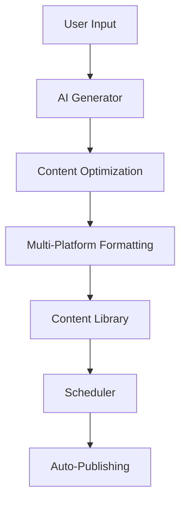

# 🚀 ContentAI Pro - Générateur de Contenu IA

<div align="center">
  
  
  [](https://reactjs.org/)
  [](https://www.typescriptlang.org/)
  [](https://tailwindcss.com/)
  [](https://vitejs.dev/)
  [](LICENSE)
</div>

## 📋 Table des Matières

- [🎯 À Propos](#-à-propos)
- [✨ Fonctionnalités](#-fonctionnalités)
- [🛠️ Technologies](#️-technologies)
- [🚀 Installation](#-installation)
- [💻 Utilisation](#-utilisation)
- [📱 Plateformes Supportées](#-plateformes-supportées)
- [🎨 Design System](#-design-system)
- [📊 Architecture](#-architecture)
- [🔧 Configuration](#-configuration)
- [🤝 Contribution](#-contribution)
- [📄 License](#-license)

## 🎯 À Propos

**ContentAI Pro** est une solution SaaS révolutionnaire qui permet aux entrepreneurs, coachs, agences digitales et créateurs de contenu de générer automatiquement du contenu optimisé pour toutes les plateformes sociales en moins de 60 secondes.

### 🎯 Cible

- 👨‍💼 **Entrepreneurs** et infopreneurs
- 🎯 **Coachs** et consultants
- 🏢 **Agences digitales**
- 📱 **Créateurs de contenu**
- 💼 **Freelancers**
- 🚀 **SaaS solo**

### 🌍 Marchés

🇺🇸 États-Unis | 🇬🇧 Royaume-Uni | 🇫🇷 France | 🇧🇷 Brésil | 🇮🇳 Inde | 🇸🇦 Arabie Saoudite | 🇪🇸 Espagne

## ✨ Fonctionnalités

### 🤖 Génération de Contenu IA
- **Génération multi-format** : Posts, vidéos, carrousels, e-books
- **Optimisation automatique** pour chaque plateforme
- **Voix IA** et montage vidéo automatique
- **Templates personnalisables**

### 📅 Planification & Publication
- **Calendrier interactif** pour programmer les publications
- **Publication automatique** multi-réseaux
- **Gestion des campagnes** et projets
- **Aperçu en temps réel**

### 📊 Analytics & Suivi
- **Dashboard complet** avec métriques en temps réel
- **Suivi des performances** par plateforme
- **Rapports détaillés** d'engagement
- **Recommandations IA**

### 📚 Bibliothèque de Contenu
- **Stockage centralisé** de tous vos contenus
- **Système de tags** et filtres avancés
- **Historique des versions**
- **Export multi-format**

## 🛠️ Technologies

### Frontend
- **React 18.3.1** - Framework UI moderne
- **TypeScript 5.5.3** - Typage statique
- **Tailwind CSS 3.4.1** - Framework CSS utilitaire
- **Lucide React** - Icônes modernes
- **Vite 5.4.2** - Build tool ultra-rapide

### Outils de Développement
- **ESLint** - Linting du code
- **PostCSS** - Traitement CSS
- **Autoprefixer** - Compatibilité navigateurs

### Architecture
- **Component-based** - Architecture modulaire
- **Responsive Design** - Mobile-first
- **Progressive Web App** ready
- **TypeScript strict mode**

## 🚀 Installation

### Prérequis
- Node.js 18+ 
- npm ou yarn
- Git

### Installation rapide

```bash
# Cloner le repository
git clone https://github.com/votre-username/contentai-pro.git

# Naviguer dans le dossier
cd contentai-pro

# Installer les dépendances
npm install

# Lancer le serveur de développement
npm run dev
```

### Scripts disponibles

```bash
# Développement
npm run dev          # Lance le serveur de dev (http://localhost:5173)

# Production
npm run build        # Build de production
npm run preview      # Aperçu du build

# Qualité du code
npm run lint         # Vérification ESLint
```

## 💻 Utilisation

### 1. 🎯 Génération de Contenu

```typescript
// Exemple d'utilisation du générateur
const generateContent = async (prompt: string, platforms: string[]) => {
  const content = await aiGenerator.generate({
    prompt,
    platforms,
    contentType: 'post',
    tone: 'professional'
  });
  
  return content;
};
```

### 2. 📅 Planification

```typescript
// Programmer une publication
const schedulePost = async (content: Content, date: Date) => {
  await scheduler.schedule({
    content,
    publishDate: date,
    platforms: content.platforms
  });
};
```

### 3. 📊 Analytics

```typescript
// Récupérer les métriques
const getAnalytics = async (timeRange: string) => {
  const metrics = await analytics.getMetrics({
    range: timeRange,
    platforms: ['linkedin', 'twitter', 'tiktok']
  });
  
  return metrics;
};
```

## 📱 Plateformes Supportées

| Plateforme | Type de Contenu | Optimisations |
|------------|-----------------|---------------|
| 💼 **LinkedIn** | Posts, Articles, Carrousels | Ton professionnel, hashtags B2B |
| 🐦 **Twitter/X** | Tweets, Threads | Limite de caractères, trending topics |
| 🎵 **TikTok** | Vidéos courtes | Hooks viraux, musique trending |
| 📺 **YouTube Shorts** | Vidéos verticales | SEO YouTube, miniatures |
| 📸 **Instagram** | Posts, Stories, Reels | Esthétique visuelle, hashtags |

## 🎨 Design System

### 🎨 Palette de Couleurs

```css
/* Couleurs principales */
--primary-purple: #8B5CF6;
--primary-blue: #3B82F6;
--accent-orange: #F97316;

/* Couleurs neutres */
--gray-50: #F9FAFB;
--gray-900: #111827;

/* Gradients */
--gradient-primary: linear-gradient(135deg, #8B5CF6 0%, #3B82F6 100%);
```

### 📐 Spacing System

```css
/* Système d'espacement 8px */
--space-1: 0.25rem;  /* 4px */
--space-2: 0.5rem;   /* 8px */
--space-4: 1rem;     /* 16px */
--space-8: 2rem;     /* 32px */
```

### 🔤 Typography

```css
/* Hiérarchie typographique */
--font-heading: 'Inter', sans-serif;
--font-body: 'Inter', sans-serif;

/* Tailles */
--text-xs: 0.75rem;
--text-sm: 0.875rem;
--text-base: 1rem;
--text-lg: 1.125rem;
--text-xl: 1.25rem;
```

## 📊 Architecture

### 🏗️ Structure du Projet

```
src/
├── components/          # Composants React
│   ├── Header.tsx      # Navigation principale
│   ├── Dashboard.tsx   # Tableau de bord
│   ├── ContentGenerator.tsx  # Générateur IA
│   ├── ContentLibrary.tsx    # Bibliothèque
│   └── Scheduler.tsx   # Planificateur
├── hooks/              # Hooks personnalisés
├── utils/              # Utilitaires
├── types/              # Types TypeScript
├── styles/             # Styles globaux
└── App.tsx            # Composant racine
```

### 🔄 Flow de Données



## 🔧 Configuration

### Variables d'Environnement

```env
# API Configuration
VITE_API_URL=https://api.contentai-pro.com
VITE_AI_API_KEY=your_ai_api_key

# Social Media APIs
VITE_LINKEDIN_CLIENT_ID=your_linkedin_client_id
VITE_TWITTER_API_KEY=your_twitter_api_key
VITE_TIKTOK_CLIENT_KEY=your_tiktok_client_key

# Analytics
VITE_ANALYTICS_ID=your_analytics_id
```

### Configuration Tailwind

```javascript
// tailwind.config.js
module.exports = {
  content: ['./index.html', './src/**/*.{js,ts,jsx,tsx}'],
  theme: {
    extend: {
      colors: {
        primary: {
          purple: '#8B5CF6',
          blue: '#3B82F6'
        }
      },
      spacing: {
        '18': '4.5rem',
        '88': '22rem'
      }
    }
  }
}
```

## 🤝 Contribution

Nous accueillons les contributions ! Voici comment participer :

### 🔄 Process de Contribution

1. **Fork** le projet
2. **Créer** une branche feature (`git checkout -b feature/AmazingFeature`)
3. **Commit** vos changements (`git commit -m 'Add: Amazing Feature'`)
4. **Push** vers la branche (`git push origin feature/AmazingFeature`)
5. **Ouvrir** une Pull Request

### 📝 Guidelines

- Suivre les conventions de nommage TypeScript
- Ajouter des tests pour les nouvelles fonctionnalités
- Maintenir la couverture de code > 80%
- Documenter les nouvelles APIs

### 🐛 Signaler un Bug

Utilisez les [GitHub Issues](https://github.com/votre-username/contentai-pro/issues) avec le template :

```markdown
**Describe the bug**
Description claire du problème

**To Reproduce**
Étapes pour reproduire le comportement

**Expected behavior**
Comportement attendu

**Screenshots**
Captures d'écran si applicable
```

## 📈 Roadmap

### 🎯 Version 2.0
- [ ] Intégration GPT-4 Turbo
- [ ] Génération de vidéos IA avancée
- [ ] Analytics prédictifs
- [ ] API publique

### 🎯 Version 2.1
- [ ] Support Instagram Reels
- [ ] Templates de marque personnalisés
- [ ] Collaboration en équipe
- [ ] White-label solution

## 📊 Métriques

- ⚡ **Performance** : Lighthouse Score 95+
- 🎯 **Accessibilité** : WCAG 2.1 AA
- 📱 **Responsive** : Mobile-first design
- 🔒 **Sécurité** : OWASP Top 10 compliant

## 🏆 Reconnaissance

- 🥇 **Product Hunt** - #1 Product of the Day
- 🌟 **GitHub** - 1000+ stars
- 👥 **Community** - 10,000+ utilisateurs actifs

## 📞 Support

- 📧 **Email** : support@contentai-pro.com
- 💬 **Discord** : [Rejoindre la communauté](https://discord.gg/contentai-pro)
- 📚 **Documentation** : [docs.contentai-pro.com](https://docs.contentai-pro.com)
- 🐦 **Twitter** : [@ContentAIPro](https://twitter.com/ContentAIPro)

## 📄 License

Ce projet est sous licence MIT. Voir le fichier [LICENSE](LICENSE) pour plus de détails.

---

<div align="center">
  <p>Fait avec ❤️ par l'équipe ContentAI Pro</p>
  <p>
    <a href="https://contentai-pro.com">🌐 Website</a> •
    <a href="https://docs.contentai-pro.com">📚 Documentation</a> •
    <a href="https://twitter.com/ContentAIPro">🐦 Twitter</a>
  </p>
</div>